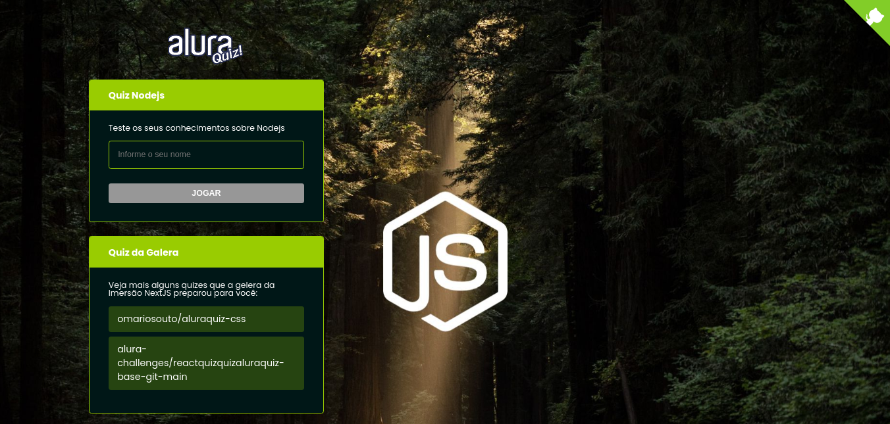

<h1 align="center"> Node Quiz 🍃 </h1>

<h1 align="center" >
  
</h1>

## 💻 Projeto

Node Quiz - É um projeto feito para testar seus conhecimentos sobre NodeJS.

Esse projeto foi desenvolvido com as seguintes tecnologias:

- [React](https://reactjs.org)
- [Nextjs](https://nextjs.org/)
- [Styled Components](https://styled-components.com/)
- [Frame Motion](https://www.framer.com/motion/)
- [Lottie](https://lottiefiles.com/)

## 💻 Executando

### Pré-requisitos

É necessário ter instalado na sua máquina para execução desse projeto:

- [Node.js](https://nodejs.org/en/)
- Gerenciador de pacotes ([Npm](https://www.npmjs.com/) ou [Yarn](https://yarnpkg.com/))

### 💻 Clonando o Repositório

```bash
$ git clone https://github.com/ThiLourenco/project-quiz.git
# entre na pasta do projeto
```
### 💻 Rodando o Node Quiz

Entre na pasta

```bash
$ cd nodequiz
```
Instale as dependências

```bash
$ yarn
# ou, caso use npm
$ npm i
```

Rode a aplicação

```bash
$ yarn dev
# ou, caso use npm
$ npm run dev
```

## 🍃 Porta

- Servidor http://localhost:3000


Projeto desenvolvido durante a Imersão React Next.Js oferecida pela [Alura](https://www.alura.com.br/).

### 📝 Licença

Este projeto está sob licença do MIT. Veja o arquivo [Licença](/LICENSE.md) para mais detalhes.